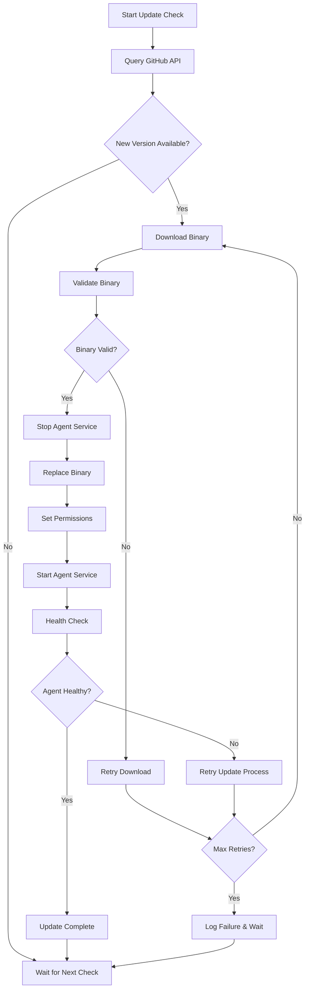

# Nodelink Agent Updater Specification

## Overview

The Nodelink Agent Updater is a simple bash script that runs as a systemd service to automatically monitor for new agent releases and perform seamless updates. The updater is installed along with the agent service using the existing `setup.sh` script and operates independently to keep the agent up-to-date while preserving all existing configuration.

## Current Implementation Issues

The existing updater has several critical limitations:

1. **No configuration preservation**: May lose environment variables during binary replacement
2. **Poor error handling**: Limited recovery mechanisms when updates fail
3. **No health validation**: Doesn't verify the updated agent is working correctly
4. **Limited rollback capability**: Basic backup mechanism without comprehensive recovery
5. **Manual restart logic**: Fragile restart mechanism using systemctl and process signals

## Improved Design

### Architecture

```
┌─────────────────────────────────────────────────────────────┐
│                   Nodelink Updater Script                  │
│                  (Bash script as service)                  │
├─────────────────────────────────────────────────────────────┤
│  Main Loop:                                                 │
│    1. Sleep for configured interval (default: 30 minutes)  │
│    2. Check GitHub API for new releases                    │
│    3. Compare with current agent version                   │
│    4. If newer version available:                          │
│       ├── Download new updater script (always)             │
│       ├── Replace updater script atomically                │
│       ├── Restart updater service (new instance continues) │
│       ├── Download new agent binary                        │
│       ├── Validate downloaded binary                       │
│       ├── Stop agent service                               │
│       ├── Replace agent binary atomically                  │
│       ├── Start agent service                              │
│       └── Verify service is healthy                        │
│    5. If update fails: retry with backoff                  │
│    6. Log all operations                                    │
│    7. Return to step 1                                     │
└─────────────────────────────────────────────────────────────┘
```

### Script Structure

The updater is implemented as a single bash script (`nodelink-updater.sh`) with the following key functions:

#### 1. Main Loop Functions
- `check_for_updates()`: Query GitHub API and compare versions
- `download_binary()`: Download and validate new agent binary
- `update_agent()`: Stop service, replace binary, restart service
- `verify_update()`: Check systemd status and agent version
- `log_operation()`: Structured logging for all operations

#### 3. Retry logic
No retry logic. The main loop should handle the retry on the next update check based on the specified CHECK_INTERVAL.

#### 2. Safety Features
- **Atomic Operations**: All file operations are atomic
- **Service Preservation**: Never modifies service configuration
- **Error Handling**: Comprehensive error handling with retries
- **Logging**: Detailed logging for troubleshooting

## Implementation Details

### Script Configuration

**Build-Time vs Runtime Configuration Strategy:**

For maximum simplicity and reliability, most configuration should be set at **build time** with only user-specific settings remaining configurable:

#### Build-Time vs Hardcoded Variables
```bash
# Version injected during build (only dynamic value)
VERSION="__VERSION_PLACEHOLDER__"

# Repository hardcoded (never changes for this project)
REPO_OWNER="mooncorn"
REPO_NAME="nodelink"

# Static configuration (could change on new release)
AGENT_BINARY_PATH="/usr/local/bin/nodelink-agent"
TEMP_DIR="/tmp/nodelink-updater"
LOG_FILE="/var/log/nodelink/updater.log"
CHECK_INTERVAL=180 # 3 minutes
```

#### Benefits of Hardcoded Configuration
1. **Maximum Simplicity**: No configuration management or build complexity
2. **Reliability**: Fewer build steps and potential failure points
3. **Clarity**: Values are immediately visible in source code
4. **Fast Builds**: No string processing required
5. **Self-Contained**: Script works immediately after download

**Note**: Only the version requires build-time injection since it changes with each release. Repository details are hardcoded since they never change for this project.

### Update Process Flow



### Self-Update Process

The updater always updates itself when a new agent version is available:

1. **Check Latest Release**: Query GitHub API for new version
2. **Download New Updater**: Fetch updated script matching the new agent version
3. **Replace Script**: Atomically replace current script
4. **Restart Service**: Service restart picks up new version
5. **Update Agent**: Continue with agent update using new updater logic

**Rationale**: Since updater and agent versions are synchronized, whenever there's a new agent version, there's also a corresponding new updater version that should be used.

### Benefits of This Approach

1. **Consistency**: Agent and updater versions always align
2. **Simplicity**: One version number to track
3. **Automatic**: No manual updater updates required
4. **Reliable**: Updater bugs get fixed automatically
5. **Traceable**: Easy to know which updater version was used

### Service Installation

3. **Create systemd service**:
```bash
sudo tee /etc/systemd/system/nodelink-updater.service << EOF
[Unit]
Description=Nodelink Agent Updater
Documentation=https://github.com/mooncorn/nodelink
After=network.target
Wants=network.target

[Service]
Type=simple
User=root
Group=root
ExecStart=/usr/local/bin/nodelink-updater.sh
Restart=always
RestartSec=60
StartLimitInterval=300s
StartLimitBurst=3

# Security settings
NoNewPrivileges=true
PrivateTmp=true
ProtectSystem=false
ProtectHome=true
ReadWritePaths=/usr/local/bin /var/log/nodelink /tmp

# Logging
StandardOutput=journal
StandardError=journal
SyslogIdentifier=nodelink-updater

[Install]
WantedBy=multi-user.target
EOF
```

#### Integration with setup.sh

The updater script can be installed using the existing setup.sh script. The setup.sh script curls for the updater script and sets up the updater service along with the agent setup process.

### Release Process Updates

The GitHub Actions workflow should be updated to include the updater script.
